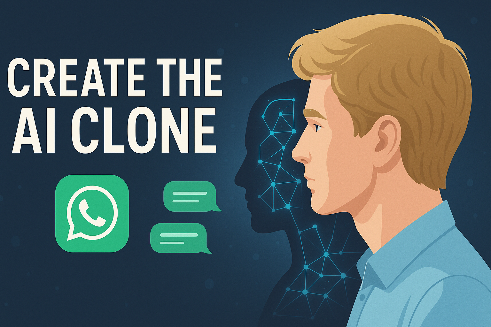

<h1 align="center">
  <span style="font-size: 1.5em;">🤖 Train Your Digital Twin</span> <br />
  <span style="font-size: 1em;">Fine-Tune an AI Clone of Yourself</span>
</h1>

<p align="center">
  
</p>


<p align="center">
  <b> What if your WhatsApp messages could become the training ground for an AI that talks just like you? <br />
  <b> This project fine-tune a large language model on your chat history to create your digital twin.</b>
</p>

<p align="center">
  <a href="https://pytorch.org/get-started/locally/"></a>
  <a href="https://github.com/meta-llama/"></a>
  <a href="https://huggingface.co/meta-llama/Meta-Llama-3-8B-Instruct"></a>
  <a href="https://github.com/kinggongzilla/torchtune"></a>
</p>

<h1 align="center">🎬 Demo — Talk to Your Digital Twin</h1>

<p align="center">
  
</p>

<p align="center">
  <i>See your <b>AI clone</b> respond in your own tone, style, and humour — all locally and privately.</i>
</p>

## What This Project Does

This repository lets you fine-tune a conversational LLM (Llama 3 or Mistral 7B) on your own WhatsApp conversations.
The goal? To create an AI clone that mirrors your tone, humour, quirks, and personality.

### Core Components

- **Chat preprocessing:** Transform WhatsApp `.txt` exports into structured, model-ready datasets.  
- **QLoRA finetuning:** Efficiently fine-tune massive models on GPUs.  
- **Conversational interface:** Talk to your digital twin directly from the terminal/Gradio.

> 💭 *Think of it as ChatGPT — but it’s you.*

**Supported base models**
- [Meta-Llama-3-8B-Instruct](https://huggingface.co/meta-llama/Meta-Llama-3-8B-Instruct)  
- [Mistral-7B-Instruct-v0.2](https://huggingface.co/mistralai/Mistral-7B-Instruct-v0.2)

Both models can be fine-tuned using QLoRA adapters, drastically reducing memory usage while preserving performance.

---

## ⚙️ Getting Started

### 1. Clone the repository
```bash
git clone --recurse-submodules git@github.com:plefloch123/AICLONE-GPT.git
cd AICLONE-GPT
```

### 2. Install Dependencies

Ensure you have **PyTorch ≥ 2.4** installed ([installation guide](https://pytorch.org/get-started/locally/)).

Then install the **Torchtune** fine-tuning framework:

```bash
cd torchtune
pip install .
cd ..
```
Note that slight modifications to the torchtune library ChatDataset class code were necessary, hence we're not installing from the official repo.

### 3. Downloading the base model
### 🔹 Llama3
Run ```tune download meta-llama/Meta-Llama-3-8B-Instruct --output-dir model/llama3 --hf-token <HF_TOKEN>```. Replace <HF_TOKEN> with your hugging face access token. In order to download Llama3 you first need to request access on the Meta Llama3 Huggingface page.

### 🔹 Mistral
Run ```tune download mistralai/Mistral-7B-Instruct-v0.2 --output-dir model/mistral```. 

If you downloaded the model in another format (e.g. safetensors), please adjust the checkpoint_files in ```mistral/qlora_train_config.yaml```.
Adjust parameters like learning rate, epochs, and batch size inside the config file for better personalisation.

### 4. Obtaining and preprocessing your WhatsApp chats
To prepare your WhatsApp chats for training, follow these steps:

1. **Export your WhatsApp chats** as .txt files. 
    - On your phone, open a chat → tap **⋮ → More → Export Chat → Without Media**.
    - You can export one or multiple chats — each will produce its own `.txt` file.
2.  **Move the exported files** to: ```data/unformatted_text```. 
3.  **Preprocess your chats**
Run the all-in-one preprocessing script:
```bash
python process_data.py "Your Name"
```
Replace ```"Your Name"``` with how your name appears in the chat exports.

## 🧠 Fine-Tuning Your Model

Once your chat data is ready, it’s time to fine-tune your model using QLoRA!

### Llama3
Run ```tune run lora_finetune_single_device --config config/llama3/qlora_train_config.yaml```

### Mistral
Run ```tune run lora_finetune_single_device --config config/mistral/qlora_train_config.yaml```

You can adjust hyperparameters like learning rate, batch size, and epochs directly inside the YAML config files.

## 🗣️ Chatting With Your AI Clone

After training, you can start talking to your digital twin.

### Llama3
Run ```python chat.py --config config/llama3/inference_config.yaml```

You can define your own system prompt by changing the ```prompt``` string in the ```config/llama3/inference_config.py``` file.

### Mistral
For mistral to fit onto 24GB I first had to quantize the trained model. 

1. Run ```tune run quantize --config config/mistral/quantization.yaml```
2. Run ```tune run chat.py --config config/mistral/inference_config.yaml```

Running this command loads the finetuned model and let's you have a conversation with it in the commandline.

## ⚙️ Hardware Requirements

| GPU                | VRAM     | Notes                                                      |
| ------------------ | -------- | ---------------------------------------------------------- |
| RTX 4090 × 2       | 24 GB each | Used for all fine-tuning and inference in this project     |
| RTX 3090           | 24 GB     | Fully supports Llama 3 fine-tuning                         |
| RTX 4070 / 4080    | 16–20 GB  | Recommended with QLoRA for smaller models                  |
| < 16 GB GPUs       | —         | Use quantization or reduce batch size and context length   |


## 💡 Tips & FAQ

### 🧩 The model isn’t learning my tone!
Try increasing the number of **epochs** in `config/llama3/qlora_train_config.yaml`.

---

### 📜 The preprocessing script fails.
Adjust the **regex** pattern in `prepare_data.py` to match your region’s WhatsApp export format  
(e.g., `DD/MM/YYYY` vs. `MM/DD/YYYY`).

---

### 👥 Can I include group chats?
Currently **not supported**.  
If you’d like to include them, you’ll need to modify the preprocessing logic to handle multi-user conversations.

---

### 🌍 My chats are not in English.
Fine-tuning works best with **English-language** data.  
If your chats are in another language, consider adjusting tokenization and training parameters for better results.
But I tried in french and still works well.

---

## 🧪 Common Notes

- After training, experiment with **temperature** and **top_k** in your `inference_config.yaml`:

  | Parameter | Effect |
  | ---------- | ------- |
  | `temperature = 0.2` | Factual & consistent replies |
  | `temperature ≥ 0.7` | More creative & expressive replies |

- Longer chat histories help the model capture your full communication style.  

## Common Issues / Notes
* After training, adjust temperature and top_k parameters in the ```inference_config.yaml``` file. I found a temperature of 0.2 and top_k of 10000 to work well for me. 
* Finetuning works best with English chats. If your chats are in another language, you may need to adjust the preprocessing and training parameters accordingly.
